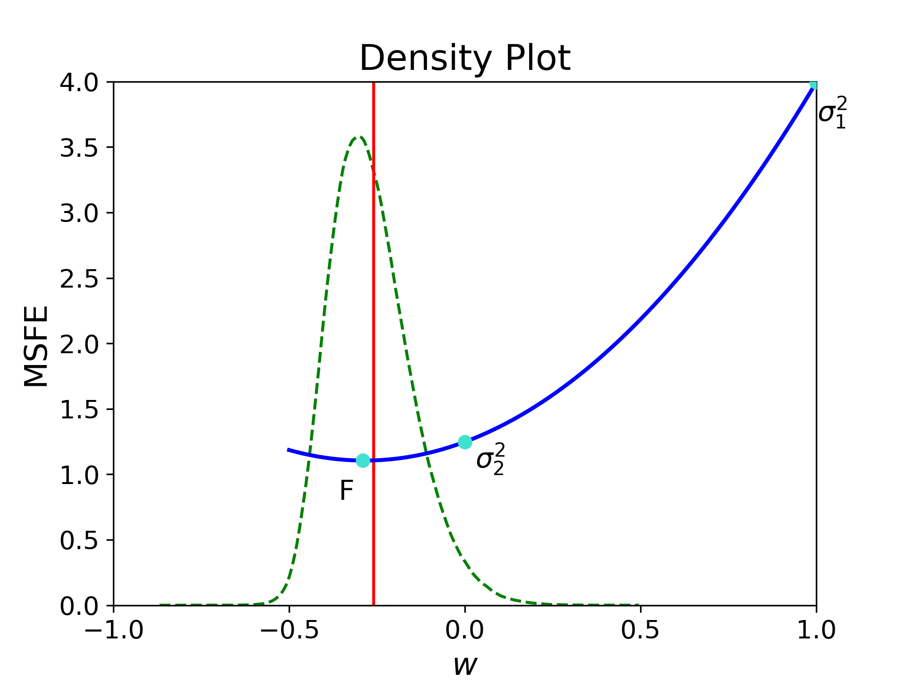

# Test project
The aim for this file is to become a template for future project. So everything is ready for all new projects coming year.
I hope this will improve the work and make it possible to simultaneously work on the code.
There are python files were people can work on the code. If everything is done, these can be added to the Jupiter file with more explanation.
The rest of this readme file contains examples on how to design future readmes, inspired by the ones created by *The Economist*'s github page.


## Getting started

Before finalizing the jupyter noteboook, please make use the python scripts are finished, seen in [this file](https://github.com/YannickvanEtten/test_project/blob/d783b368ecf9c11b1b1c41d0dc0d7426cc7a8513/main.py).
To install it, first install the devtools package:

```r
install.packages('devtools')
```
(This is just how to add a R space in a markdown)

## Conclusion
In the following graph, we note a ... trend.
  
